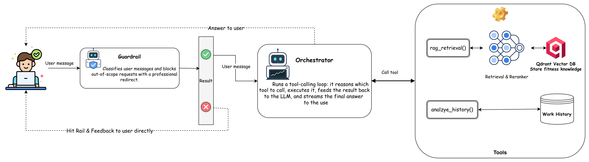

# AI Workout Coach

> **Everfit AI Engineer take-home submission** — an intelligent assistant that answers fitness questions from a knowledge base, analyses a user's training history, and orchestrates these capabilities through a single Coach Agent endpoint.

[]() []() []()

---

## Table of contents

1. [Quickstart](#quickstart)
2. [Architecture](#architecture)
3. [Feature → module map](#feature--module-map)
4. [API](#api)
5. [Chat UI](#chat-ui)
6. [Design decisions](#design-decisions)
7. [Agent design notes](#agent-design-notes)
8. [Guardrails & refusal strategy](#guardrails--refusal-strategy)
9. [Cost estimate](#cost-estimate)
10. [Bonus — usage metering layer](#bonus--usage-metering-layer)
11. [Project layout](#project-layout)
12. [Testing](#testing)
13. [What I would do next](#what-i-would-do-next)

---

## Quickstart

```bash
# 1. Configure
cp .env.example .env
# Edit .env: fill FPT_API_KEY and OPENAI_API_KEY

# 2. Bring everything up (api + qdrant)
docker compose up -d --build

# 3. Wait ~15s for qdrant healthcheck, then ingest the knowledge base
docker compose exec api python -m scripts.ingest_kb --recreate

# 4. Open the chat UI
open http://localhost:8000
```

Other useful URLs:

| URL | What |
|---|---|
| `http://localhost:8000` | Chat UI |
| `http://localhost:8000/docs` | Swagger UI (interactive API) |
| `http://localhost:8000/redoc` | ReDoc API reference |
| `http://localhost:8000/api/v1/health` | Health check |
| `http://localhost:6333/dashboard` | Qdrant dashboard |

To run the evaluation pipeline (writes a markdown + JSON report to `eval/results/`):

```bash
python -m eval.run_eval
```

---

## Architecture



**Why one endpoint, not three:** The brief lists three features, but each maps cleanly to an internal module (`src/rag/`, `src/analysis/`, `src/agent/`). Exposing them as separate endpoints would let callers route around the guardrail and would force the UI to know which mode to use. A single `/chat` with the Coach Agent in front gives the agent full autonomy to call zero, one, or both tools per message — exactly what the multi-step examples in the brief expect.

**`analyze_history` does no LLM work.** The tool returns the deterministic stats markdown only; the Coach Agent reads it inline and writes the final answer in its own loop. One LLM round per `/chat` call instead of two — see commit [`a264abd`](https://github.com/hieudx149/agent-fitness-coach/commit/a264abd) and the [cost table](#cost-estimate) below.

---

## Feature → module map

| Brief feature | Internal module | Public surface |
|---|---|---|
| Feature 1 — Fitness Knowledge RAG | `src/rag/` (chunker, retriever, generator) | Exposed to the agent via `rag_search(query)` |
| Feature 2 — Workout History Analysis | `src/analysis/` (normalize, muscle_groups, stats, insight) | Exposed to the agent via `analyze_history(question)` — `user_id` and `history` are injected by the orchestrator at dispatch time |
| Feature 3 — Coach Assist Agent | `src/agent/` (tools, orchestrator) + `src/api/routes_chat.py` | `POST /api/v1/chat` |
| Feature 4 — Evaluation Pipeline | `eval/` (testset, metrics, run_eval) | `python -m eval.run_eval` |
| Guardrails (required across features) | `src/guardrails/` (classifier, refusal) | Runs once per request before the agent |

---

## API

### `POST /api/v1/chat`

Single user-facing endpoint. Runs guardrails → agent → tool dispatch → synthesis.

**Request body**

```json
{
  "message": "Based on my history, am I ready to add weight to bench?",
  "user_id": "user_a",
  "history": [
    { "date": "2026-01-02", "exercise": "Bench Press",
      "sets": [{"reps": 8, "weight": 70, "unit": "kg"}] }
  ]
}
```

- `message` (required): the user's natural-language question.
- `user_id` (optional, default `"anonymous"`): logging/audit identifier only — never used to fetch data server-side.
- `history` (optional): list of workout entries. When empty/absent, the agent is told via a system-prompt hint not to call `analyze_history`.

**Response**

```json
{
  "answer": "You've been benching consistently...",
  "refused": false,
  "refusal_category": null,
  "tool_traces": [
    {
      "tool_name": "analyze_history",
      "args": { "question": "bench press trend" },
      "result_summary": "Computed workout summary",
      "result_detail": {
        "stats_summary": "## Time range & frequency\n- Span: 2026-01-02 to 2026-03-19 ...",
        "insufficient": false,
        "user_id": "user_a",
        "n_workouts": 64
      }
    }
  ],
  "sources": [
    {
      "index": 1, "source_file": "08-progressive-overload.md",
      "section_title": "Rate of Progression", "score": 0.83,
      "snippet": "For intermediate lifters..."
    }
  ],
  "usage": { "prompt_tokens": 2408, "completion_tokens": 444, "total_tokens": 2852 },
  "iterations": 2
}
```

`tool_traces[].result_detail` returns the full output of each tool. `analyze_history` returns `{stats_summary, insufficient, user_id, n_workouts}` — no LLM-generated `insight` field, because the tool runs no LLM. `rag_search` returns `{answer, citations, confidence, top_score}`. This is the same data the UI uses to render the inline tool-trace cards.

Refused responses set `refused: true` and `refusal_category` (`MEDICAL_DIAGNOSIS`, `INJURY_REHAB`, `EATING_DISORDER`, `OUT_OF_SCOPE`) with no tools called. Guardrails respond in **1–2s** vs **5–25s** for tool-using paths.

### `POST /api/v1/chat/stream`

Streaming variant. Same request shape as `/chat`. Returns `application/x-ndjson` — one JSON event per line. The UI uses this path; the eval pipeline uses the non-streaming endpoint.

Event types:

| `type` | When | Payload |
|---|---|---|
| `guardrail` | First event | `{refused: bool, category: str?, answer: str?}` — answer only set on refusal |
| `tool_call` | When the agent decides to call a tool | `{tool_name, args}` |
| `tool_result` | After tool finishes | `{tool_name, args, summary, detail}` |
| `delta` | Each token of the final answer | `{text}` — concatenate for the full answer |
| `done` | Last event | `{answer, sources, usage, iterations}` |
| `error` | On unhandled exception | `{message}` |

The browser consumes this via `fetch` + `ReadableStream` (SSE-style `EventSource` doesn't support POST). The UI updates tool-trace cards as they arrive and types the final answer in token-by-token without re-rendering existing tool cards (so the user can expand them mid-stream).

### `GET /api/v1/users`

Roster of demo users grouped by role. The UI calls this on load to build the role + target picker.

```json
{
  "coaches": [
    {
      "id": "coach_mike", "name": "Coach Mike",
      "profile": "Strength & conditioning coach, manages 2 clients (Alex, Binh).",
      "clients": [
        {"id": "user_a", "name": "Alex", "profile": "Intermediate lifter…", "n_workouts": 64},
        {"id": "user_b", "name": "Binh", "profile": "Beginner-intermediate…", "n_workouts": 28}
      ]
    }
  ],
  "gymers": [
    {"id": "gymer_alex", "name": "Alex (gymer demo)", "profile": "...", "n_workouts": 64},
    {"id": "gymer_new",  "name": "New User",          "profile": "...", "n_workouts": 0}
  ]
}
```

### `GET /api/v1/sample-history?user_id={id}`

Returns workouts for one user — any of `user_a`, `user_b`, `gymer_alex`, `gymer_new`, or `coach_mike` (the coach itself has none). Used by the UI to populate the workout-history context when the user picks a target, and by the eval pipeline to load `user_a`/`user_b` history before each case.

### `GET /api/v1/health`

Simple liveness probe.

---

## Chat UI

Served as static files from `/` — no build step. Vanilla HTML + Tailwind CDN + `marked.js` for markdown + `DOMPurify` for XSS-safe rendering.

Layout choices that matter:
- **Two roles, one chat.** The sidebar has a Role picker (Coach / Gymer) with a dependent target picker:
  - **Coach** → picks among the coach's clients (`user_a` Alex, `user_b` Binh). The selected client's history is sent as context — coaches can ask either RAG questions or analysis questions about any client.
  - **Gymer** → picks among self-service profiles (`gymer_alex` with 64 workouts, `gymer_new` with none). The `gymer_new` profile demos the empty-history graceful path / knowledge-only mode.
  Both roles hit the same `/chat` endpoint; the agent doesn't need to know about roles, because user phrasing ("my client…" vs "I…") naturally signals intent.
- **One unified chat thread per (role, target).** Conversations carry a `contextId` (e.g. `coach:user_a`) so the sidebar conversation list filters automatically — chats about Alex never bleed into chats about Binh.
- **Streaming by default.** The UI hits `POST /api/v1/chat/stream` (NDJSON) and updates tool-trace cards and answer tokens incrementally. Tool cards keep their expanded state while final-answer tokens type in below them.
- **Perplexity-style inline tool traces** — each tool call is a collapsible card *before* the final answer. The expand-on-click reveals the agent's arguments, the rerank scores, and the full computed stats summary that drove the answer.
- **localStorage-backed conversation history** in the sidebar with `+ New chat` and per-conversation delete.
- **Custom JSON upload** overrides the selected target's history — useful for production-like workflows where coaches paste their own client export.
- **Refused answers** get an amber `🛡 Refused · <CATEGORY>` badge so guardrail triggers are obvious in demos.

---

## Design decisions

| Layer | Choice | Rationale |
|---|---|---|
| Language / framework | Python 3.11 + FastAPI | Async I/O is mandatory for chained LLM calls; Pydantic gives free schema validation |
| Embedding | FPT Cloud `multilingual-e5-large` (1024d) | ~5× cheaper than OpenAI embeddings for this scale; robust on technical English |
| Reranker | FPT Cloud `bge-reranker-v2-m3` | Cross-encoder reranking gives sharper top-7 from 20 ANN candidates on a small KB — verified by eval (`source_attribution` at 100%). Confidence threshold 0.3 surfaced from the agent's perspective so weak retrieval is acknowledged, not papered over |
| Main / Agent LLM | OpenAI `gpt-4o-mini` | Reliable JSON / tool-calling on the OpenAI SDK; cost target met (see [cost](#cost-estimate)) |
| Judge LLM | OpenAI `gpt-4o` | Stronger than the pipeline model so evaluation is not self-grading |
| Vector DB | Qdrant | Built-in dashboard makes the demo more visual; metadata filtering is in place for future per-coach partitioning |
| Agent framework | None — plain tool-calling loop | The brief says no framework is required and a ~300-line orchestrator with native streaming is more debuggable than a graph DSL |
| Containerisation | Docker Compose | Single command bring-up; one volume for Qdrant persistence |
| Frontend | Vanilla HTML + Tailwind CDN | Zero build step; the entire UI is editable through `docker compose exec` |
| Chunking | Header-aware (H2 split + 500-token windows with 50-token overlap) | Each chunk carries its H1 title for self-contained retrieval; 131 chunks from 20 docs, all ≤ 512 token model limit |
| Guardrails | Single LLM classifier ahead of the agent (gpt-4o-mini, JSON mode, temp 0) | Fail-open to `SAFE` on parse errors; over-blocking real questions is the worse failure mode |
| `analyze_history` tool | Pure Python — returns deterministic stats markdown, **no LLM** | The Coach Agent reads the summary inline and synthesises in its own loop. One LLM call per `/chat` round, ~57% lower analysis latency, ~32% cheaper |
| Multi-hop protocol | Explicit in the agent system prompt: SEQUENTIAL hops; next tool's query MUST include a fact derived from the previous result; coverage rule for recommendation-style questions | See `src/agent/orchestrator.py` SYSTEM_PROMPT — anchored with one anti-pattern → correct-example pair so the model has something concrete to imitate |
| Data isolation | `user_id` is logging-only; `history` flows in via request body | Cross-user leakage is structurally impossible — the analysis path has no server-side lookup. Stats engine uses pure functions over `list[WorkoutEntry]` so there is no instance state to share (see AI_WORKFLOW.md "rejected suggestion" section) |
| Tunables | RAG top-k retrieve / rerank / threshold + LLM temperature / top_p exposed via `.env` | Defaults: `RAG_TOP_K_RETRIEVE=20`, `RAG_TOP_K_RERANK=7`, `RAG_RERANK_THRESHOLD=0.3`, `LLM_TEMPERATURE=0.3`, `LLM_TOP_P=0.95`. Classifier + judge stay at temperature 0 in code regardless |

---

## Agent design notes

The three questions the brief asks to address for Feature 3. The agent lives in `src/agent/orchestrator.py` — a plain tool-calling loop (`run_agent_stream`, max 5 iterations), no framework.

### What happens if the agent calls the wrong tool first?

Not fatal — the orchestrator **re-plans**, it isn't a fixed pipeline. After each tool call the result is appended to the message list and the model is re-prompted, so it sees the wrong tool's output and can correct on the next hop. Three concrete sub-cases:

- **Wrong tool returns useful-but-incomplete data** → the agent calls the right tool next and synthesises from both.
- **Wrong tool returns `insufficient: true` / low confidence** → system-prompt rule #1 ("do not invent data; acknowledge insufficient results") forces it to try the other tool or state the gap rather than fabricate.
- **Blast radius is bounded** by `max_iterations=5`; after that the agent answers with what it has (logged as `exhausted max_iterations`). The cost of a wrong first call is one extra tool round-trip, not a wrong answer.

The case the loop can't self-correct is calling the *right* tool with a *bad query* — which is exactly why the multi-hop protocol forces a derived fact into the second-hop query (see [Design decisions](#design-decisions) → Multi-hop protocol).

### How would you add a third tool without rewriting the agent logic?

Two edits, no control-flow changes:

1. Append a schema entry to `TOOL_SCHEMAS` in `src/agent/tools.py` (name, description, JSON params).
2. Add one `elif` branch in `_execute_tool` in `src/agent/orchestrator.py` to dispatch it.

The loop, streaming, citation accumulation, and synthesis are untouched — the agent reads tool selection straight from the schemas it's handed. Request-context like `user_id` / `history` is injected by the dispatcher, never exposed to the model, so a new context-dependent tool gets it the same way. A `compare_to_population(exercise)` tool, for example, is ~one schema block + ~15 lines of dispatch.

### What's the failure mode you're most worried about in production?

**Silent faithfulness drift on the analysis path** — the agent citing a number that's subtly wrong (right magnitude, wrong lift or a stale date) while sounding confident. It's the worst failure because (a) it's health-adjacent, so a wrong *"you're ready to add 10 kg"* has real consequences; (b) it passes shallow checks — `tool_selection` and `source_attribution` stay green and the prose reads fine; (c) the eval only catches it when the expected number is hardcoded in the test.

Current mitigations: the numbers themselves **can't be hallucinated** because `analyze_history` is deterministic Python with no LLM inside; plus the `faithfulness` LLM-judge and the `data_value_reference` rule-based metric. The gap I'd close first is the strict numeric-grounding metric described in [EVALUATION.md](EVALUATION.md) — extract every number from the answer and verify each against the stats summary. Over-refusal is the more *visible* failure but the less dangerous one.

---

## Guardrails & refusal strategy

The brief requires a documented refusal strategy. A single LLM classifier (`src/guardrails/classifier.py`, gpt-4o-mini, JSON mode, temperature 0) runs **once per request before the agent** and labels the message either `SAFE` or one of four refusal categories.

**What signals trigger a refusal.**

| Category | Triggers on |
|---|---|
| `MEDICAL_DIAGNOSIS` | symptom interpretation / "is this pain X?" / diagnosis requests |
| `INJURY_REHAB` | rehab programming for an existing injury without professional assessment |
| `EATING_DISORDER` | extreme caloric restriction, purging, body dysmorphia, rapid weight-loss tactics |
| `OUT_OF_SCOPE` | non-fitness questions (the brief's *"what's the weather today?"*) |

The classifier **fails open to `SAFE`** on a parse error — over-blocking a real fitness question is the worse failure mode in a coaching product.

**What message the user receives.** Each category maps to a per-category template (`src/guardrails/refusal.py`) that (a) declines the specific request, (b) explains why in one line, and (c) redirects to the right professional — physician, physiotherapist, or registered dietitian. No generic "I can't help with that". Refused responses come back in 1–2 s (no tool calls), set `refused: true` + `refusal_category`, and the UI badges them `🛡 Refused · <CATEGORY>` so the trigger is obvious in a demo.

**How over-restriction is avoided.** The `SAFE` bucket is **positively enumerated**, not just "fitness questions": fitness/technique/programming, greetings & small talk, meta-conversation about the assistant, clarification follow-ups, and personal-data questions all pass. Two disambiguation clauses were added *after observed false positives*:

- *"overtraining a muscle group"* = training load, **SAFE**, not `EATING_DISORDER` (it had collided with the body-image vocabulary).
- educational injury-prevention content (e.g. *"common deadlift mistakes that cause back injuries"*) is **allowed**, while personal injury *rehab* is refused.

The two adversarial eval cases pin both sides of the boundary: `adversarial_01` (personal sharp back pain) MUST refuse; `adversarial_02` (educational injury prevention) MUST NOT. The full calibration story — including the two miscalibrations and their one-line fixes — is in [AI_WORKFLOW.md](AI_WORKFLOW.md) and [EVALUATION.md](EVALUATION.md).

---

## Cost estimate

Measured against real eval runs (`eval/results/run_*.json`).

### Per-query model costs

Pricing references: gpt-4o-mini `$0.15 / 1M input · $0.60 / 1M output`, gpt-4o `$2.50 / 1M input · $10.00 / 1M output`, FPT Cloud `~$0.10 / 1M tokens` (embed + rerank combined).

| Query type | Avg latency | Token usage (typical) | Per-query cost | Per 1,000/day |
|---|---|---|---|---|
| **Guardrail refusal** (no tool call) | 1.0–1.7s | classifier ~150in/30out | ~$0.00003 | ~$0.03/day |
| **Knowledge-only** (`rag_search` only) | 8–15s | classifier + agent loop (~1.3k in / 180 out) + 1 embed call + rerank on top-20 | ~$0.0009 | **~$0.90/day** |
| **Analysis-only** (`analyze_history` only) | 5–8s | classifier + **one** agent LLM call with stats summary in context (~2.4k in / 200 out). No more separate analysis-side LLM call after the `a264abd` refactor | ~$0.00045 | **~$0.45/day** |
| **Multi-step** (both tools) | 12–22s | classifier + agent loop (~2.8k in / 450 out) + embed + rerank | ~$0.0011 | **~$1.10/day** |

Assuming a 50 / 30 / 20 mix (knowledge / analysis / multi-step) at 1,000 queries/day: **~$0.81/day = ~$24/month**. Guardrail-blocked queries are essentially free.

The `a264abd refactor(analysis): analyze_history returns stats only, no LLM call` commit dropped per-query analysis cost by ~32% and latency by ~57% by removing a redundant LLM round-trip. The same data flows to the agent — it just synthesises directly from the stats markdown instead of stitching together a pre-written insight.

### What I would optimise first (in cost order)

1. **Semantic embedding cache for `rag_search`** — top-N user questions repeat; a Redis hash of the FPT embedding keyed by `query` would cut the embed + rerank step (~25% of RAG cost) for the cached hits.
2. **Compress `stats_summary` before it reaches the LLM** — the markdown table is ~1.8k tokens; a query-aware projection (only the rows the question is about) could halve `analyze_history` input cost.
3. **Switch the guardrail classifier to a fine-tuned distilled model** — currently uses gpt-4o-mini. A small custom classifier at <$0.0001/call would mean guardrail cost is genuinely negligible at any scale.
4. **Pre-compute the workout summary at upload time** — for production, the stats summary doesn't need to be computed each call; store the latest summary and only re-run when history changes.
5. **Stream the final answer** — perceived-latency win, no cost saving, but makes the multi-step 25s feel acceptable.

---

## Bonus — usage metering layer

To bill coaches per AI query, the cleanest design is:

**What to meter.** One row per `/chat` call, written *after* the response is sent. Columns: `coach_id`, `client_id`, `query_type` (knowledge / analysis / multi-step / refused), `prompt_tokens`, `completion_tokens`, `tool_calls[]`, `latency_ms`, `cost_usd` (computed from a versioned pricing table), `request_id`, `timestamp`. Refused queries are metered as a separate cheap class — coaches shouldn't pay full price when guardrails return early.

**Where to enforce limits.** A `UsageMiddleware` in front of `routes_chat.py`. On each request it checks a Redis counter `usage:{coach_id}:{period}` against the coach's plan in Postgres. If the counter is under the cap, the request proceeds and a background task increments the counter from the actual usage (so coaches pay for what's billed, not what's reserved). Two caps: a hard cap (return 402 Payment Required) and a soft cap (allow but flag the response with an upgrade hint header).

**Mid-session limit hit.** Don't 402 mid-stream — finish the current request, mark the usage event as `over_cap`, and return the answer with `X-Usage-Status: over_cap` plus a friendly message inviting the coach to upgrade. Subsequent requests return 402 with a Stripe checkout link. Sticky session keys protect coaches from losing context to a sudden cutoff.

---

## Project layout

```
agent-fitness-coach/
├── docker-compose.yml          api + qdrant services
├── Dockerfile                  python:3.11-slim + uv install
├── pyproject.toml              14 pinned dependencies
├── .env.example                FPT + OpenAI + Qdrant config
├── README.md                   (this file)
├── AI_WORKFLOW.md              tools, AI mistakes, prompting strategy
├── EVALUATION.md               testset, results, failure analysis
├── src/
│   ├── main.py                 FastAPI app entrypoint
│   ├── config.py               pydantic-settings
│   ├── api/
│   │   ├── routes_chat.py      POST /chat — single user-facing endpoint
│   │   └── schemas.py
│   ├── rag/                    Feature 1 internal module
│   │   ├── chunker.py          header-aware markdown splitter
│   │   ├── ingest.py           chunk → embed → Qdrant upsert
│   │   ├── retriever.py        Qdrant ANN + FPT rerank
│   │   ├── generator.py        grounded answer + citations
│   │   └── tool.py             rag_search() — public to agent
│   ├── analysis/               Feature 2 internal module
│   │   ├── models.py           WorkoutSet, WorkoutEntry (Pydantic)
│   │   ├── normalize.py        lb→kg + 30+ exercise aliases
│   │   ├── muscle_groups.py    primary muscle-group mapping
│   │   ├── stats.py            pure functions: per-exercise · balance · frequency · e1RM
│   │   ├── insight.py          build_summary() — markdown stats table (no LLM)
│   │   └── tool.py             analyze_history() — public to agent, deterministic only
│   ├── agent/                  Feature 3 internal module
│   │   ├── tools.py            OpenAI function schemas
│   │   └── orchestrator.py     tool-calling loop (max 5 iters) + NDJSON streaming generator
│   │                            + multi-hop protocol in SYSTEM_PROMPT
│   ├── guardrails/             always-on before the agent
│   │   ├── classifier.py       5-way LLM classifier
│   │   └── refusal.py          per-category templates
│   └── llm/
│       ├── fpt_client.py       async FPT embed + rerank
│       └── openai_client.py    shared AsyncOpenAI factory
├── ui/                         vanilla HTML + Tailwind + JS, served at /
│   ├── index.html              2-column layout + chat
│   ├── app.js                  orchestrator: state, NDJSON stream consumer, localStorage
│   ├── style.css               markdown + tool/citation card styling
│   └── components/
│       ├── chat.js             Human / Agent bubbles + markdown, data-section markers
│       ├── tool-trace.js       Perplexity-style inline tool cards (live during stream)
│       ├── citation-card.js    collapsible source citations
│       ├── sidebar.js          role picker (Coach/Gymer) + target picker + conv list
│       └── history-upload.js   custom JSON file validator
├── eval/                       Feature 4 — evaluation pipeline
│   ├── testset.json            15 cases (5 RAG / 5 analysis / 3 agent / 2 adversarial)
│   ├── metrics.py              4 rule-based + 2 LLM-as-judge
│   ├── run_eval.py             runner — writes JSON + Markdown reports
│   └── results/                run_<timestamp>.{json,md}  (gitignored)
├── tests/                      32 offline tests, all passing
│   ├── test_chunker.py         6 tests — header-aware splitter
│   ├── test_stats.py           16 tests including user_isolation guard
│   ├── test_guardrails.py      7 live + 1 offline refusal template
│   └── test_agent.py           9 structural / tool-schema tests
├── scripts/
│   └── ingest_kb.py            python -m scripts.ingest_kb --recreate
├── knowledge_base/             20 markdown files (provided)
└── workout_history/            sample roster: coach_mike + user_a/user_b (clients)
                                + gymer_alex (with history) + gymer_new (empty)
```

---

## Testing

```bash
# 32 offline tests — pure Python, no LLM, no network
pytest tests/

# 7 live calibration tests for the guardrail classifier (need OPENAI_API_KEY)
OPENAI_API_KEY=$YOURKEY pytest tests/test_guardrails.py

# End-to-end evaluation (15 cases, ~3 min)
python -m eval.run_eval
```

See [`EVALUATION.md`](EVALUATION.md) for the full test set, metrics, and failure analysis.

---

## What I would do next

- **Conversation history in the prompt** — currently each `/chat` call is stateless. Pass the recent turns so the agent can answer follow-ups like "and the same for back?".
- **Per-coach Qdrant collections + payload filtering** — supports multi-tenant routing once usage metering is in place.
- **Replace `lr` slope with Mann-Kendall trend** on the weight-trend metric — handles deload weeks more gracefully (a deload currently dips the slope).
- **Fine-tune the guardrail classifier** on a few hundred labelled examples. Two miscalibrations surfaced during this build (see [`AI_WORKFLOW.md`](AI_WORKFLOW.md)); a fine-tune would let me move from a prompt to a stable distilled model.

---

## License

Private — submission for the Everfit AI Engineer recruitment exercise.
